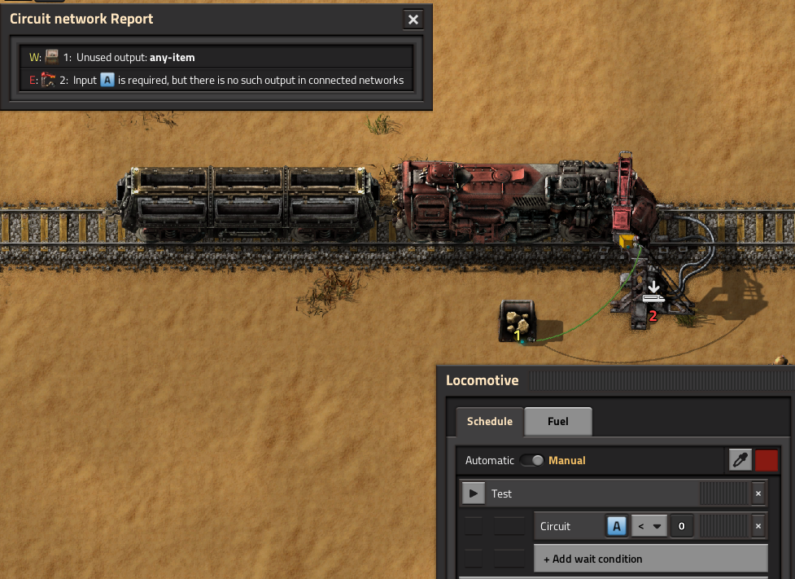

# Circuit Checker

This is a mod for Factorio.

This mod helps in troubleshooting your circuit networks.
Adds shortcut (Alt-C by default) to find possible flaws in circuit. Finds unmatched inputs, unused outputs, missed wire connections.

## Demo

## Supported error messages
 - Input is required but not found in connected networks (E)
 - No input/output wires on combinator (E)
 - Input not set (E) - shows that some condition is left blank
 - Output not set (E) - shows that output signal is left blank (in accumulator settings, for example)
 - Output unused (W)
 - "Use colors" is enabled in lamp but no color output is found in connected networks (I)

## Additional features
 - Checks generic item/fluid input. For example, if inserter with "Set filter" option is connected only to storage tank, an error will be raised, since inserter requires item as input, but storage tank produces only fluid output.

 - Checks train station output. If some input requires item from train station with "Read train contents" output, but this station has only trains with fluid wagons, an error will be raised.  
 
 - Checks train circuit conditions. If train uses some signal in condition to leave station, but there is no such signal on train station, an error will be raised.
  
 - Mod compatibility - this mod uses "Control behavior" attributes of entities, not entitites themselves. Therefore, mods that make use of curcuit network must be compatible. If you find a mod that does not work, please report via mod discussion or issues on Github.

## Known Issues
 - Disconnected nixie tubes near connect report error
 - Stations from LTN are not processed correctly 
 - Each/Everything processing does not take into account which exact signals can be outputs

## Feedback
I would be glad to see any feedback on the mod. 
Is there an error raised in your network while network is correct?
Is there a missed error?
Which features would you like to see?
I am checking mod discussion and issues on Github.

## TODO
 - Bug fixes
 - Enhanced mod support

## Contribution
If you would like to help with the development of the mod or adding a translation, you can fork the repo and open PR. In file `test-blueprint-book.txt` you can find blueprint string for circuit networks that I use as unit tests. In these blueprints belts mark expected result: red belt means the entity must raise error, yellow - warning, no belt - info, blue belt - nothing.